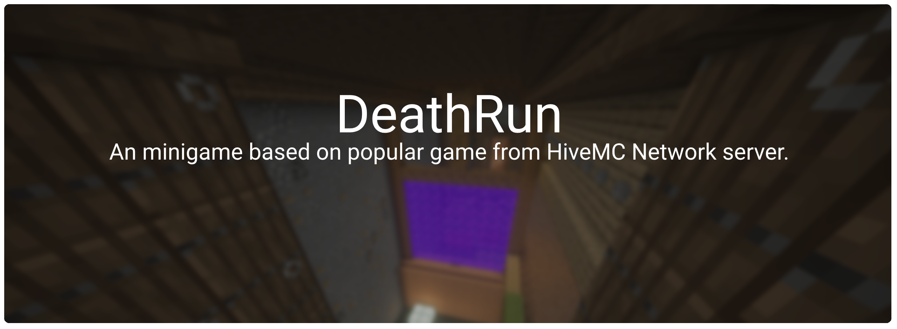

# DeathRun

DeathRun is a Paper/Spigot minigame plugin inspired by the classic HiveMC mode.
Players are split into Runners and Deaths, traps are controlled by Death players,
and matches run as independent map runtimes.

## Documentation

Detailed setup, map operations, command reference, and testing guide:

- [Setup And Operations](https://github.com/CIlie23/DeathRun/wiki)

## Quick Start

1. Build with `./gradlew :core:shadowJar -x test`.
2. Put plugin jar into server plugins folder.
3. Install WorldEdit.
4. Start server and configure maps via setup commands.

## Requirements

- Java 21
- Paper 1.21.10 (recommended)
- WorldEdit 7.2.9+
- [NoteBlockAPI](https://github.com/koca2000/NoteBlockAPI/releases)

## Known Notes

- WorldEdit is required and checked on plugin enable.
- Map restore is blocked while players are active in that map runtime.
- If map IDs are missing in old config format, they are normalized automatically.

## Contributing

Please read [CONTRIBUTING](CONTRIBUTING.md) before submitting changes.

## Libraries

- LiteCommands
- ProtocolSidebar
- Kyori Adventure
- okaeri-configs
- Zip4J
- Apache Commons IO
