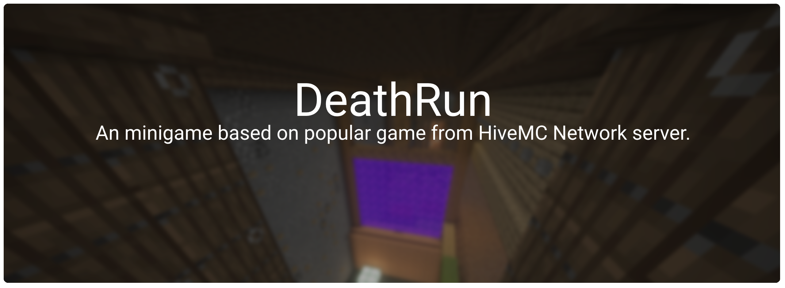

# DeathRun Classic26

DeathRun Classic26 is an AGPLv3 fork of CIlie23/DeathRun 1.4.1, migrated to
Paper 26.2 / Java 25 and extended with a HiveMC Java Classic-style gameplay
layer. It is designed to coexist with other minigames on a normal Paper server
instead of assuming the whole server is dedicated to DeathRun.

## Runtime requirements

- Paper 26.2
- Java 25
- WorldEdit 7.4.5
- PlaceholderAPI is optional
- NoteBlockAPI is not required by the Classic26 runtime

The project builds with the bundled Gradle 9 wrapper:

```bash
./gradlew clean test shadowJar
```

The plugin JAR is produced under `core/build/libs/`.

## Classic rules implemented

- Up to 22 players; default automatic start threshold is 11.
- A full Classic room is intended for 20 Runners and 2 Deaths.
- Match timer: 300 seconds.
- The first Runner to finish clamps remaining time to 60 seconds when more
  than 60 seconds remain.
- Runners start with 2 Lives.
- Each normal checkpoint grants +2 Lives.
- Runner death costs 1 Life.
- Finish adds remaining Lives to the Runner's round points.
- Left / Back / Right Strafe are in hotbar slots 4 / 5 / 6, use independent
  60-second cooldowns, 1.78 horizontal velocity and 0.30 vertical velocity.
- Death controls use Previous Trap in slot 1, Activate in slots 2-4 and 6-8,
  Trap Jumper in slot 5, and Next Trap in slot 9.
- Five-map vote UI plus a sixth Random option is available with `/dr vote`.
- Map preshow displays the selected map and creator.

## Safety on a shared server

Classic26 scopes inventory restrictions, damage rules, projectile cleanup,
explosion protection, world autosave changes, and gameplay listeners to active
DeathRun players/worlds/entities. Entering DeathRun writes a durable recovery
snapshot before destructive player-state changes. Recovery files live in:

```text
plugins/DeathRun/recovery/<UUID>.yml
```

A recovery file is deleted only after restoration succeeds. Inventory, armor,
offhand, location, game mode, flight state, XP, health/food, effects, movement
speeds, fire/fall state, and scoreboard data are restored.

Reward commands are empty by default so installing Classic26 on a shared server
does not silently inject diamonds, currency, or other economy items. Server
owners can explicitly configure reward commands when desired.

## Engineering playtest

For a quick functional test without importing a production map:

```text
/dr playtest create
/dr join classic26-playtest
/dr start classic26-playtest
```

The generated engineering course exercises checkpoints, Lives/Points, Strafe,
Death navigation, powerup blocks, and the Classic trap set including
Disappearing Parkour, Knock Back, Arrow Dispenser, Fire Floor, Flood, Wall
Spawn, Launch Players, Giant, Fire Trail, TNT, Glass Floor, Quicksand,
Block Replace, Minefield, Appearing Blocks, Disappearing Blocks and Particles.

## To Bee Or Not To Bee production profile

`1.4.1-classic26.2` includes the production-candidate reconstruction for the
archived HiveMC Java map **To Bee Or Not To Bee** (creator: **Timmetatsch**).
The repository intentionally does not redistribute the third-party world
binary; import a copy you are permitted to use as a normal Paper world first.

The current archive-backed runtime contains:

- 20 Runner starts and 2 Death starts;
- 6 in-round checkpoint/finish gates, with Portal #006 used as the start side;
- 23 surviving action-sign trap instances wired into the runtime;
- a reconstructed 14-block start barrier;
- full trap mutation/entity cleanup and restart acceptance gates.

The cross-corroborated route candidate is:

```text
#006 -> #007 -> #002 -> #001 -> #004 -> #005 -> #003
```

After the imported world is loaded, run the production setup in this order
(replace `<world>` with the imported world folder/name):

```text
/dr tobee bootstrap <world>
/dr tobee verify <world>
/dr map backup to-bee-or-not-to-bee
/dr map disable to-bee-or-not-to-bee
/dr map check to-bee-or-not-to-bee
/dr map manifest to-bee-or-not-to-bee
/dr tobee readiness <world>
/dr tobee fingerprint <world>
```

`/dr map disable` is the promotion step: it refuses to finalize the map if the
normal production preflight does not pass. `readiness` checks the promoted
idle runtime, restored start barrier, trap-entity cleanup and trap runtime
state. `fingerprint` hashes the loaded production definition (spawns,
checkpoints, barrier and all trap buttons/targets) so configuration drift can
be detected across trap runs and server restarts.

For an invasive server-side verification with no active players,
`/dr tobee runtimecheck <world>` activates all 23 traps on the real imported
world, observes their expected mutation/entity effect, restores the surrounding
BlockData envelope, removes trap entities, and reports PASS/FAIL.

Important fidelity note: later public Gardens/To Bee material refers to a
9-checkpoint version, while the pinned Java archive used by this reconstruction
physically preserves seven dense Nether-portal gate components. Classic26 does
not invent two extra gates or silently mix that later checkpoint/XP data into
this archived Java reconstruction.

Final multiplayer evidence uses `/dr map trace acceptance <id>` for event coverage
and `/dr map trace rules <id>` for numeric rules and all-player restoration.
Follow [the multiplayer acceptance rounds](docs/PLAYTEST.md) before recording a
human PASS.

## Main commands

```text
/dr maps
/dr vote
/dr join <map>
/dr leave
/dr recover
/dr start [map]
/dr stop [map]
/dr reload
/dr tobee bootstrap <world>
/dr tobee verify <world>
/dr tobee runtimecheck <world>
/dr tobee readiness <world>
/dr tobee fingerprint <world>
/dr map list
/dr map status <id>
/dr map profile interstellar <id>
/dr map creator <id> <creator>
/dr cp points <id> <points>
/dr cp ...
/dr trap ...
```

Setup/admin commands require the corresponding operator permissions declared in
`plugin.yml`.

## Classic map vote rotation

The plugin configuration supports an optional ordered map-id list:

```yaml
classic-vote-map-candidates: 5
classic-vote-map-ids:
  - safari-valley
  - temple
  - interstellar
  - toxic-factory
  - yagrium
```

When `classic-vote-map-ids` is empty, the first five eligible maps are chosen
alphabetically. Only fully configured, unlocked maps in WAITING state can
appear.

## Interstellar profile

After importing/configuring an Interstellar world and defining exactly eight
checkpoints:

```text
/dr map profile interstellar <map-id>
```

applies the confirmed Classic profile:

- Creator: Dlimit
- Checkpoint points: 3, 7, 10, 13, 16, 20, 23, 26
- Finish: checkpoint 8
- Max players: 22
- Required players: 11

## Map assets and licensing

This repository contains plugin code and the generated engineering playtest,
not third-party recreated Hive/CubeCraft map worlds. World downloads or
recreations with unclear redistribution rights are research/import sources only
and should not be committed or released here without permission.

## CI

Every push to `main` is checked by GitHub Actions using Java 25. CI runs the
unit tests, builds the shaded plugin, verifies the package, downloads Paper
26.2 and WorldEdit 7.4.5, and performs a clean Paper smoke boot.

## License and upstream

This fork remains under GNU AGPLv3 in accordance with the upstream project.
Keep the license and copyright notices when distributing modified builds.
